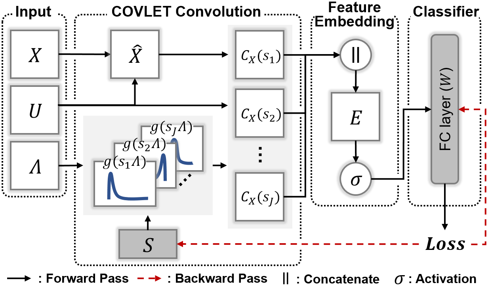

# [ISBI'23] Learning Covariance-Based Multi-Scale Representation of Neuroimaging Measures for Alzheimer Classification


- This is the official PyTorch implementation of ***Learning Covariance-Based Multi-Scale Representation of Neuroimaging Measures for Alzheimer Classification.*** [Arxiv](https://arxiv.org/abs/2503.01232v1) | [IEEE Xplore](https://ieeexplore.ieee.org/document/10230493)

<br/>
<p align="center"></p>

## Abstract
Stacking excessive layers in DNN results in highly underdetermined system when training samples are limited, which is very common in medical applications. In this regard, we present a framework capable of deriving an efficient highdimensional space with reasonable increase in model size. This is done by utilizing a transform (i.e., convolution) that leverages scale-space theory with covariance structure. The overall model trains on this transform together with a downstream classifier (i.e., Fully Connected layer) to capture the optimal multi-scale representation of the original data which corresponds to task-specific components in a dual space. Experiments on neuroimaging measures from Alzheimer’s Disease Neuroimaging Initiative (ADNI) study show that our model performs better and converges faster than conventional models even when the model size is significantly reduced. The trained model is made interpretable using gradient information over the multi-scale transform to delineate personalized AD-specific regions in the brain.

## Citation
If you find our work useful for your research, please cite the our paper:
```
@inproceedings{baek2023learning,
  title={Learning covariance-based multi-scale representation of neuroimaging measures for alzheimer classification},
  author={Baek, Seunghun and Choi, Injun and Dere, Mustafa and Kim, Minjeong and Wu, Guorong and Kim, Won Hwa},
  booktitle={2023 IEEE 20th International Symposium on Biomedical Imaging (ISBI)},
  pages={1--5},
  year={2023},
  organization={IEEE}
}
```
